# 📊 Projet AWS – Supervision Centralisée avec Zabbix (Docker)

Ce fichier contient toutes les informations nécessaires pour déployer Zabbix et assurer le monitoring des clients Windows et Linux. Il contient également les fichiers de configuration.

## 🔍 C’est quoi Zabbix ?


**Zabbix** est une **solution open-source de supervision et de monitoring** permettant de surveiller en temps réel l’état, les performances et la disponibilité des systèmes informatiques, serveurs, applications et équipements réseau.


Zabbix collecte automatiquement des métriques telles que :  
- CPU, mémoire RAM, espace disque, trafic réseau  
- Disponibilité des hôtes (ping, uptime)  
- État des services et processus  

Grâce à ses **agents installés sur les machines supervisées** (Linux, Windows, etc.), Zabbix envoie les données vers un **serveur central**, où elles sont stockées et analysées, puis visualisées via une **interface Web intuitive**.

**Fonctionnalités principales :**  
- Supervision en temps réel des ressources système  
- Tableaux de bord et graphiques dynamiques  
- Alertes et notifications en cas d’anomalie  
- Support multi-plateforme (Linux, Windows, équipements réseau)  
- Templates prédéfinis pour une configuration rapide  
- Déploiement flexible (classique ou conteneurisé via Docker)

---

## 📌 Présentation du Projet

L’objectif de ce projet est de mettre en place une **infrastructure cloud de supervision centralisée** sur **AWS** pour un **parc hybride Linux & Windows**, en utilisant **Zabbix conteneurisé via Docker**.  
Le serveur Zabbix collecte les métriques depuis les agents installés sur chaque machine et les affiche dans des **tableaux de bord** pour un suivi en temps réel.

---

## 🎯 Objectifs

- Déployer une infrastructure de monitoring centralisée sur AWS  
- Conteneuriser Zabbix via Docker et Docker Compose  
- Superviser des machines Linux et Windows  
- Visualiser les métriques en temps réel et générer des alertes  
- Respecter les contraintes du Learner Lab AWS

---

## 🏗️ Étapes du Projet

### Étape 1 : Création de l’Architecture Réseau (VPC et Security Groups)

**Objectif :** Créer un réseau virtuel public pour héberger les instances.

1. Créer le VPC dans AWS :
   - Services → VPC → Your VPCs → Create VPC → "VPC and more"
   - Nom : `NomVPC`, CIDR : 10.0.0.0/16, AZ : 1, Subnet public : 10.0.0.0/24
   - Activez DNS hostnames & DNS resolution
   - Cliquez "Create VPC"
   - **Figure 1 : Création du VPC**
   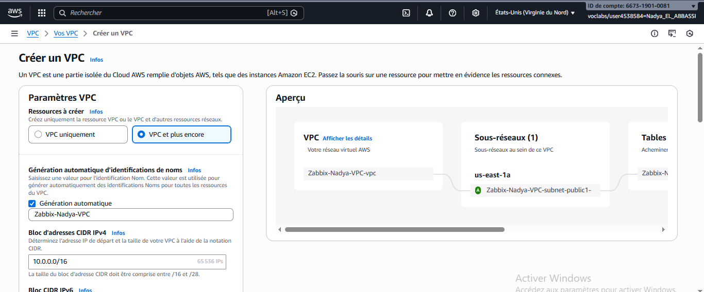
   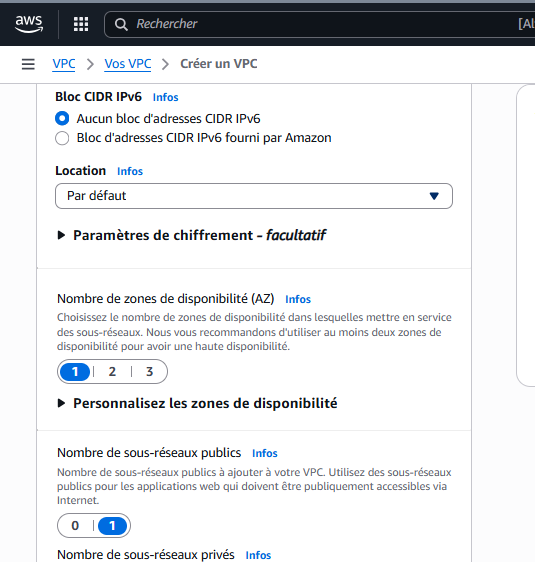
   
   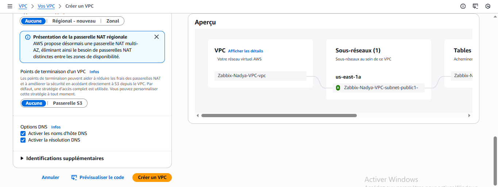

2. Vérifier Internet Gateway et Route Table :
 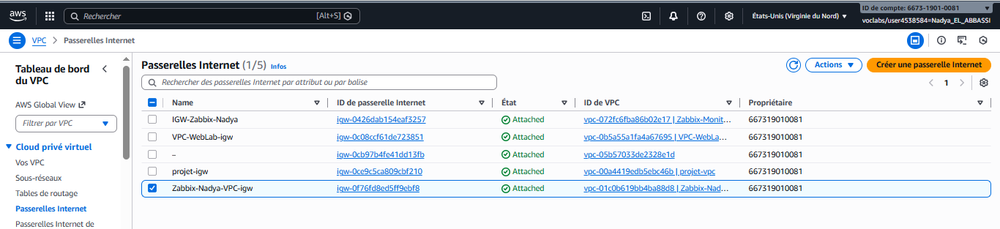

   - IGW attaché automatiquement
   - Route Table : ajouter route 0.0.0.0/0 → IGW
   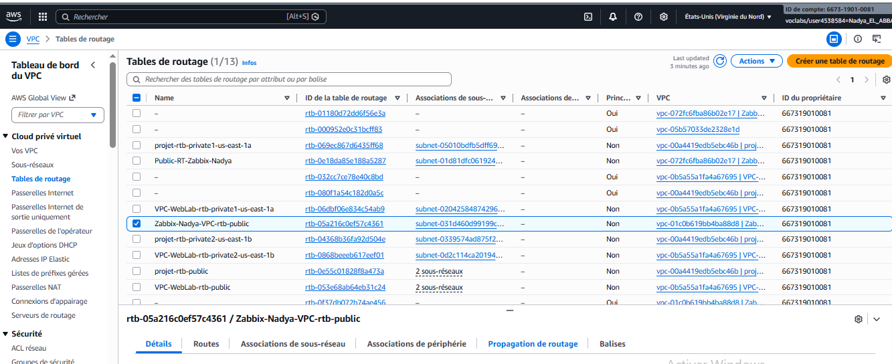
   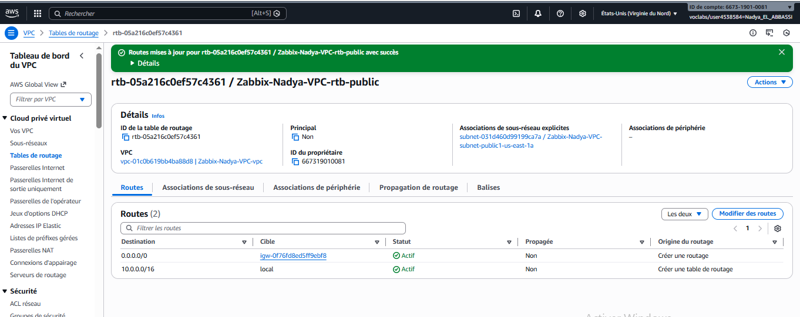
   - Associer à votre subnet public
   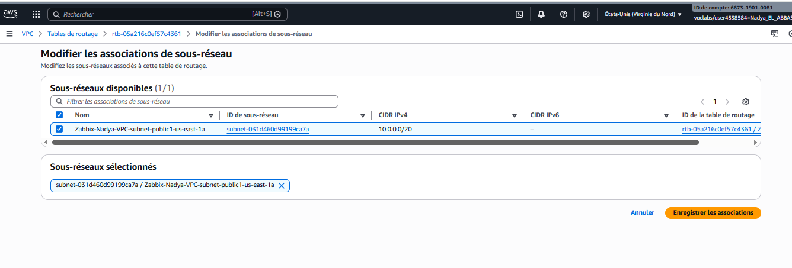
   - **Figure 2 : Subnet & IGW**

3. Créer Security Group (SG) :
   - Nom : `NomEtudiant-SG-Zabbix`
   - Inbound rules :
     - HTTP 80 Anywhere
     - HTTPS 443 Anywhere
     - TCP 10050-10051 Anywhere
     - SSH 22 My IP
     - RDP 3389 My IP
   - Outbound : par défaut
   - **Figure 3 : Security Group**
   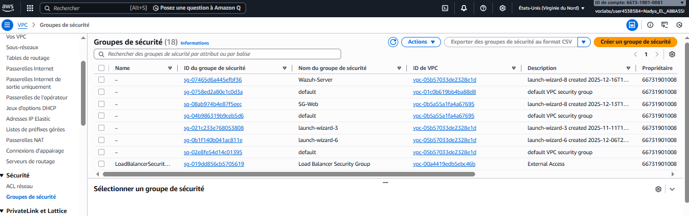
   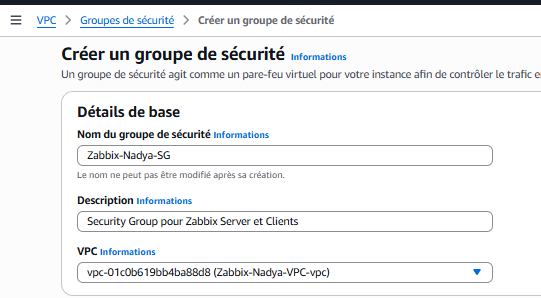
   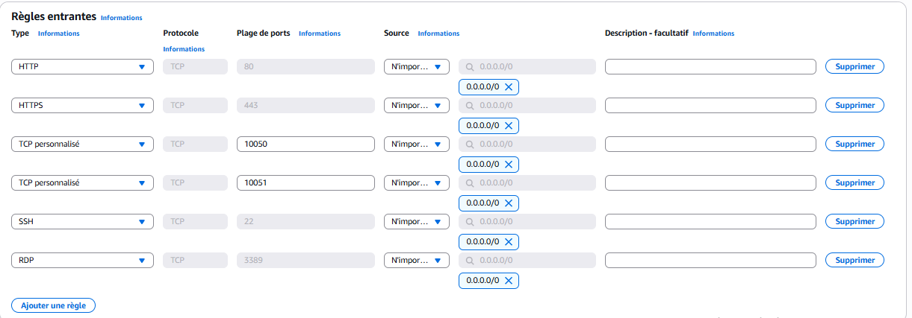
   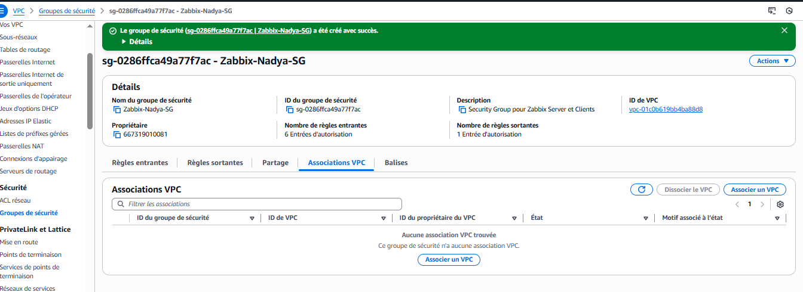

---

### Étape 2 : Lancement des Instances EC2

**Objectif :** Créer 3 machines virtuelles.

1. Créez une **Key Pair** : `NomEtudiant-Key.pem` pour toute les instances. 

2. Instances :
   - **Serveur Zabbix (Ubuntu t3.large)**  
     - AMI : Ubuntu Server 22.04 LTS  
     - VPC/Subnet public, SG, Auto-assign Public IP  
     - Stockage : 8 GiB gp3  
     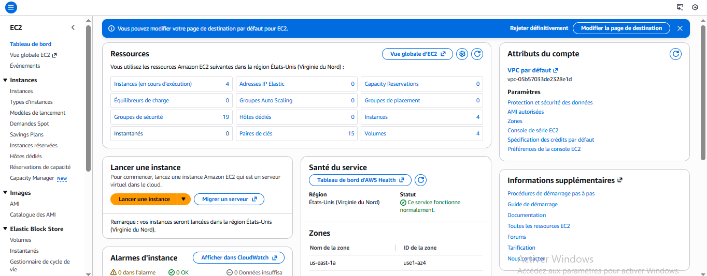
     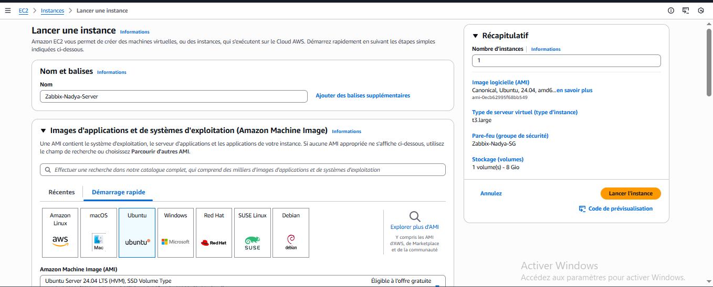
     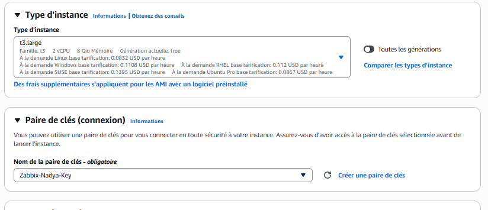
     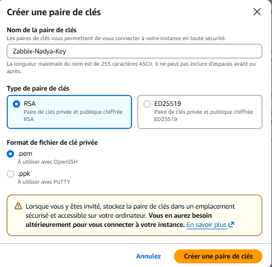
     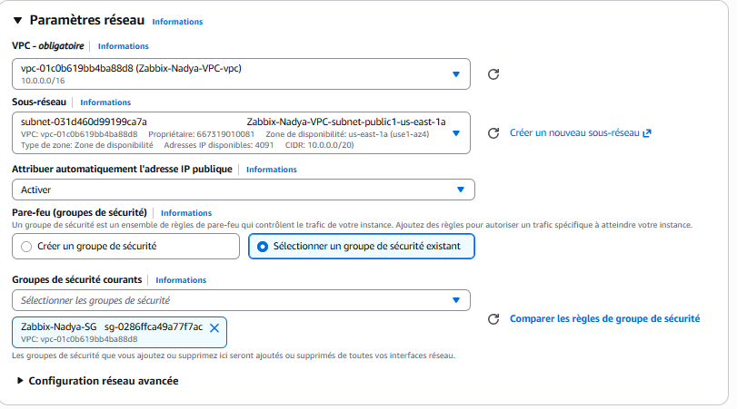
     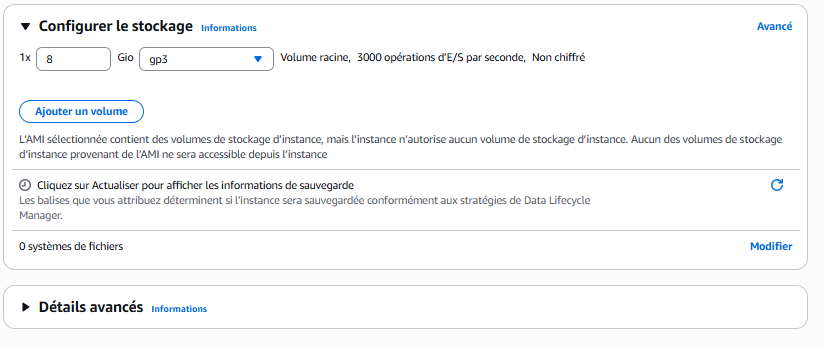
     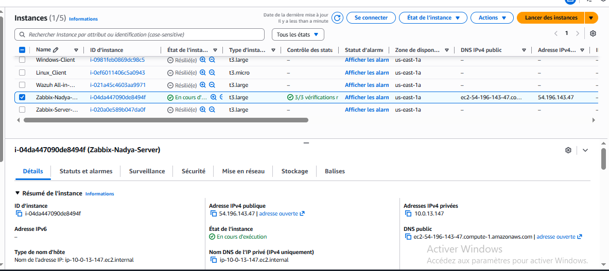
     - **Figure 4 : Instances Running**
   - **Client Linux (t3.medium)**  
   avec mème paramétres: 
     - AMI : Ubuntu 22.04, même VPC/SG  
     - Nom : `NomEtudiant-Linux-Client`
       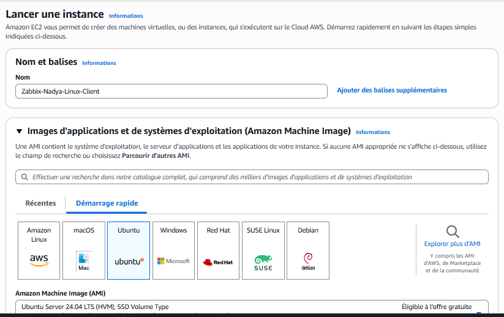
   - **Client Windows (t3.large)**  
     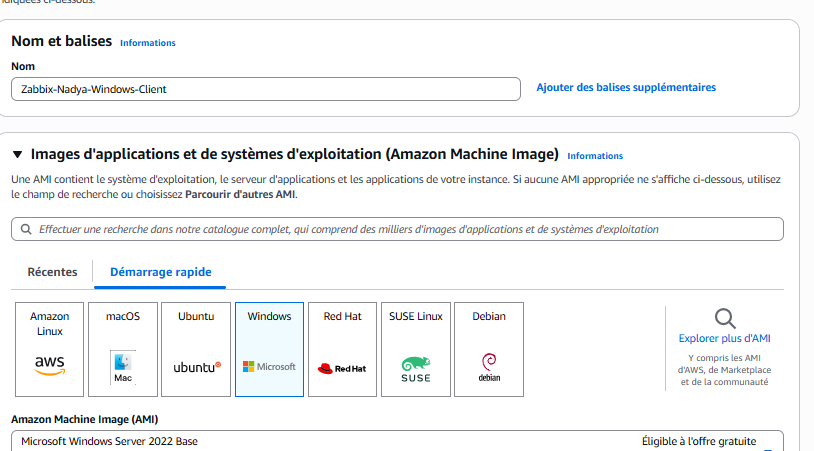
     - AMI : Windows Server 2022  
     - Nom : `NomEtudiant-Windows-Client`  
     - Décryptez le mot de passe via .pem  
     - **Figure 5 : Détails instance**

     

3. Connexions :
   - Linux SSH : `ssh -i NomEtudiant-Key.pem ubuntu@IP`
   - Windows RDP : IP, user Administrator, mot de passe décrypté

---

### Étape 3 : Déploiement du Serveur Zabbix

**Objectif :** Installer Docker et lancer Zabbix conteneurisé

1. Connexion SSH → Serveur Zabbix  
 
   sudo apt update && sudo apt upgrade -y
   sudo apt install docker.io docker-compose -y
   sudo systemctl enable docker --now
   docker --version
   docker-compose --version

2. Créer dossier & docker-compose.yml :

   mkdir zabbix && cd zabbix
   nano docker-compose.yml 
   (le code dans le fichier en haut)

   

3. Lancer conteneurs :

   ```bash
   sudo docker-compose up -d
   sudo docker ps
   ```

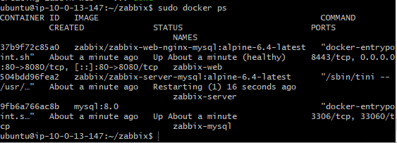

4. Interface Web : `http://IP-publique` → login `Admin / zabbix`
   **Figure 6 : Conteneurs running**
   **Figure 7 : Zabbix login réussi**

   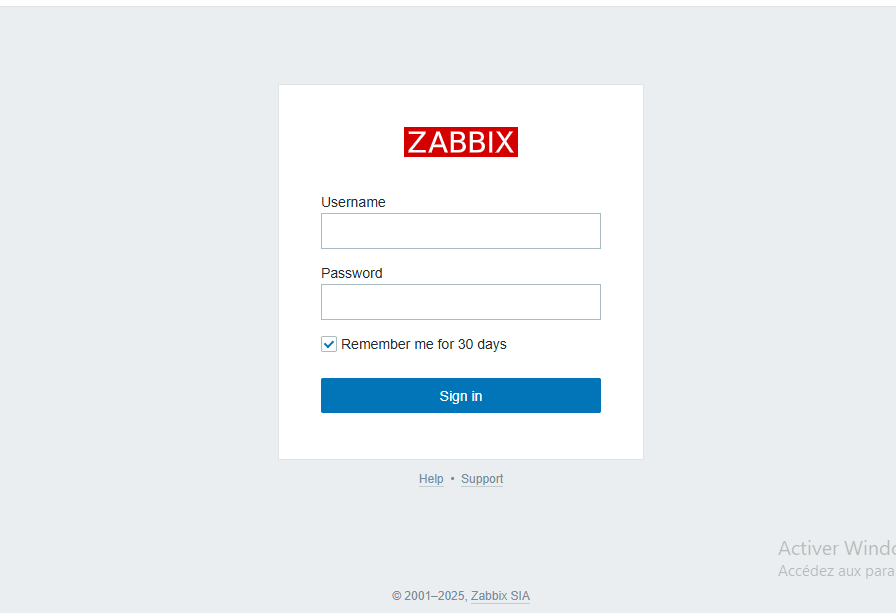
   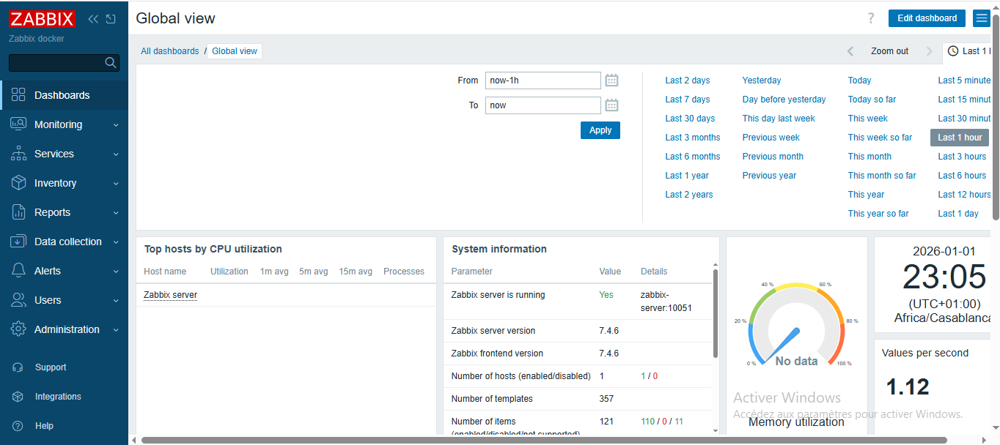


### Étape 4 : Configuration des Agents

**Client Linux :**

```bash
wget https://repo.zabbix.com/zabbix/6.4/ubuntu/pool/main/z/zabbix-release/zabbix-release_6.4-1+ubuntu22.04_all.deb
sudo dpkg -i zabbix-release_6.4-1+ubuntu22.04_all.deb
sudo apt update && sudo apt install zabbix-agent -y
sudo nano /etc/zabbix/zabbix_agentd.conf
# le code  de configuration du fichier et au dessus  zabbix_agentd.conf
sudo systemctl restart zabbix-agent
sudo systemctl enable zabbix-agent
sudo systemctl status zabbix-agent
```
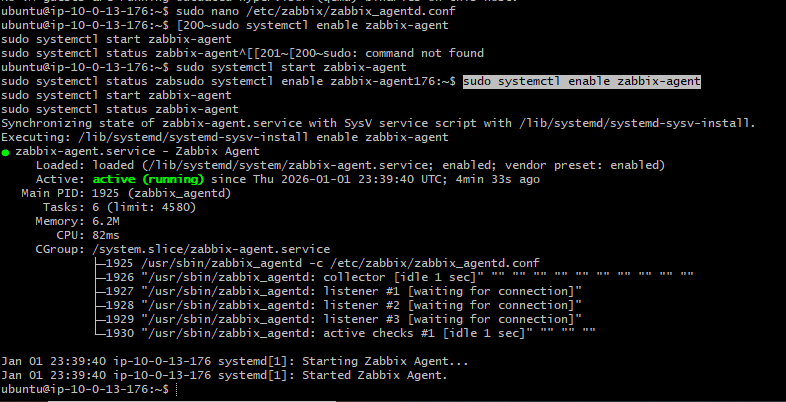

**Client Windows :**


* Télécharger MSI 6.4 64-bit → installer
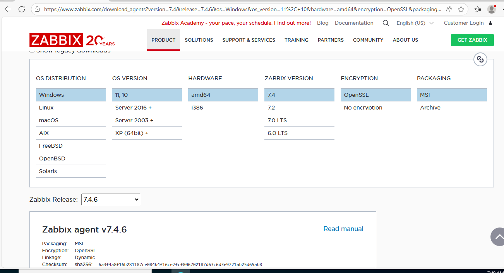
* Configurer `zabbix_agentd.conf` : Server, ServerActive, Hostname
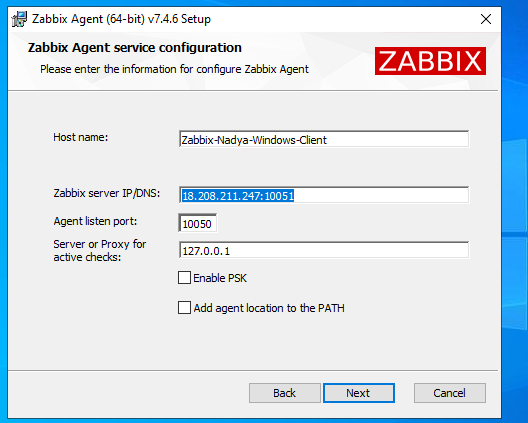
* Redémarrer service `Zabbix Agent`
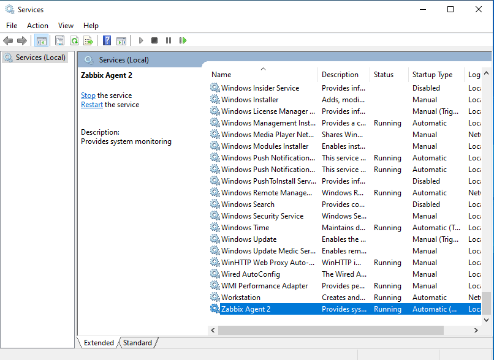
* **Figure 8 : Configuration agents**


---

### Étape 5 : Monitoring dans Zabbix

1. Ajouter hôtes :

   * Linux : Group `Linux servers`, Template `Linux by Zabbix agent`
   * Windows : Group `Windows servers`, Template `Windows by Zabbix agent`
   * **Figure 9 : Hosts verts**

   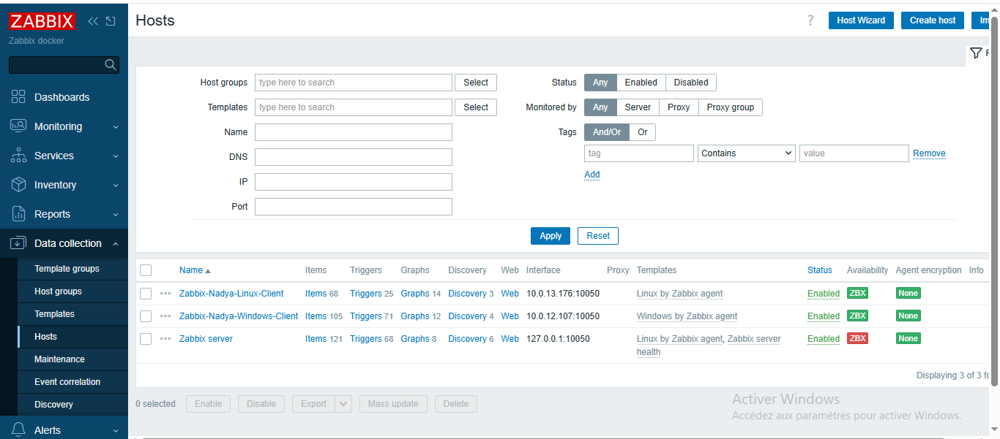

2. Vérifier métriques :
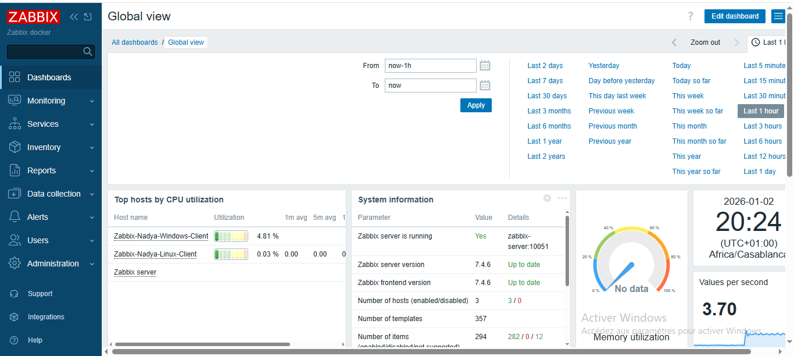

  

3. Tester alertes :

   * Configuration → Actions → trigger CPU > 80%
   * Stress test : `sudo apt install stress -y` → `stress --cpu 4`

---

### Conclusion

Ce projet a permis de déployer et configurer Zabbix sur AWS afin de superviser des instances Linux et Windows. Il met en évidence l’utilisation du cloud, de Docker et des agents Zabbix pour le suivi des performances système (CPU, mémoire, disponibilité). Cette réalisation a renforcé les compétences en monitoring, cloud computing et administration système.

## 🧠 Acquis et Compétences

* Cloud AWS et architecture réseau (VPC, SG)
* Conteneurisation Docker & Zabbix
* Supervision multi-OS
* Administration Linux & Windows
* Gestion sécurité réseau et monitoring avancé
